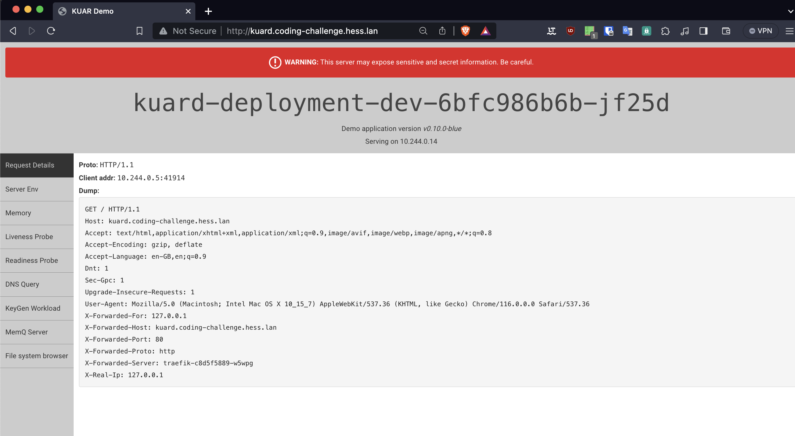
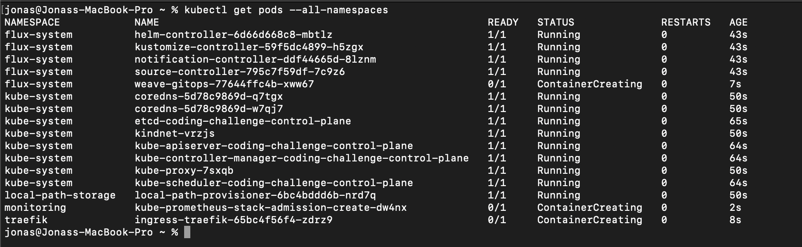
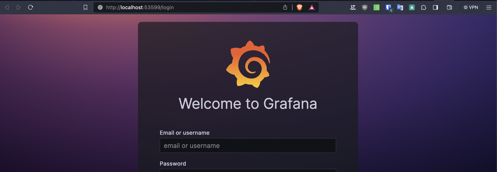
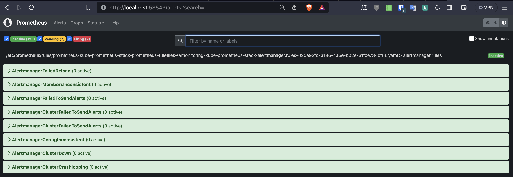
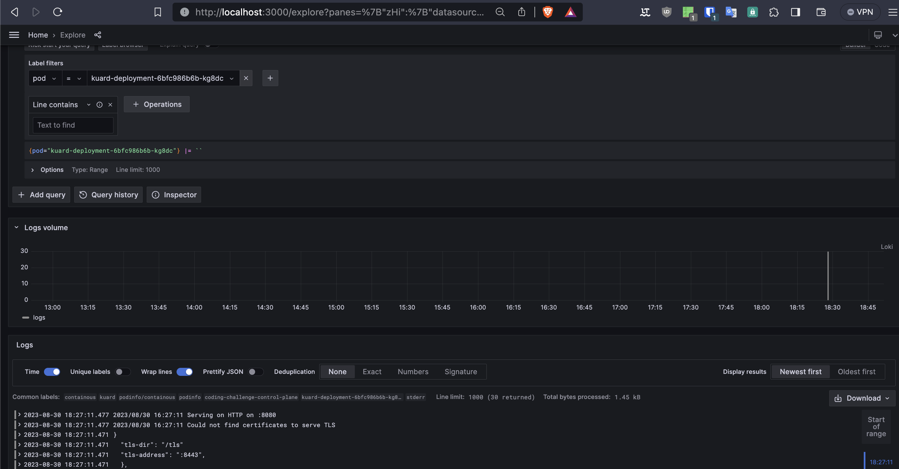
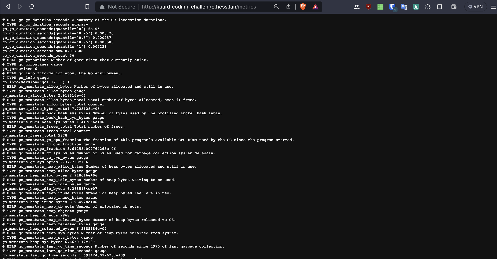

# DevOps Coding Challenge








## Wie würde eine Logging Lösung in einem Kubernetes Umfeld aussehen?

beschreibe wie die Komponenten einer möglichen Logging Lösung zusammenarbeiten.

#### Prometheus

- Sammelt kontinuierlich Metriken von Anwendungen und Infrastrukturkomponenten im Cluster.
- Speichert Metriken in die TSDB (Time-Series-Database) und ermöglicht das Setzen von Alarmregeln.

#### Promtail

- Agent auf den Cluster-Knoten, erfasst Protokolldaten von Anwendungen.
- Strukturiert und sendet Protokolle an Loki zur Aggregation und Speicherung.

#### Loki

- Aggregiert Protokolldaten von Promtail und anderen Quellen.
- Indiziert und komprimiert Protokolle für effiziente Speicherung.
- Ermöglicht schnelle Abfragen und Suche für Fehlerbehebung und Analyse.

#### Grafana

- Bietet benutzerfreundliche Oberfläche für Visualisierung und Analyse von Prometheus-Metriken.
- Erstellung von Dashboards mit Metrikdiagrammen und Trends.

#### Alertmanager

- Überwacht Prometheus-Alarmregeln und -Benachrichtigungen.
- Leitet Benachrichtigungen bei Schwellenwertüberschreitungen oder Ereignissen weiter.
- Benachrichtigungen über verschiedene Kanäle wie E-Mail oder Slack.


## Wie kann mit Kubernetes Boardmitteln sichergestellt werden, dass die Applikation mit einer hohen Anzahl an Requests auskommt?

#### Horizontale Pod-Autoskalierung (HPA):
- Kubernetes bietet die Möglichkeit, Pods automatisch basierend auf CPU-Auslastung oder anderen Metriken horizontal zu skalieren.
- Neue Pods werden bei steigender Last automatisch gestartet und bei geringerer Last heruntergefahren.

#### Kubernetes-Deployment:
- Verwende ein Kubernetes-Deployment, um die Anzahl der laufenden Pods zu kontrollieren.
- Deployments ermöglichen Rolling Updates ohne Ausfallzeiten, was besonders wichtig bei Skalierungsänderungen ist.

#### LoadBalancer Service:
- Ein LoadBalancer-Service verteilt eingehende Anfragen gleichmäßig auf die bereitgestellten Pods.
- Dies verbessert die Skalierbarkeit und Verteilung der Last auf die Pods.

#### Cluster-Autoskalierung:
- Kubernetes kann den gesamten Cluster automatisch skalieren, indem zusätzliche Nodes hinzugefügt werden.
- Diese Funktion erfordert oft Integration mit Cloud-Providern zur Skalierung der Infrastruktur.

#### Caching und Optimierung:
- Implementiere sinnvolle Caching-Mechanismen, um häufige Anfragen zu beschleunigen und die Belastung zu reduzieren.
- Optimiere den Code und die Datenbankabfragen, um die Anwendungsleistung zu steigern.


## Wie kann man Fehler im Templating vor einem Deployment erkennen?

#### Code Reviews:

- Identifizieren Fehler frühzeitig im Entwicklungsprozess.
- Klare Richtlinien für Code Qualität etablieren.
- Kleinere Code Reviews für effektive Fehlererkennung.
- Verständlicher Code erleichtert Fehlerfindung.
- Funktionalität gemäß Anforderungen überprüfen.
- 
#### Merge Requests:
- Automatisierte CI/CD-Pipelines integrieren Tests (Unit, Integration, Regression).
- Automatisierte Tools für statische Code-Analyse nutzen. (Sonar Qube)
- Code standards sicherstellen. (Linting)
- Aussagekräftige Dokumentation beifügen.

#### Automatisierte Validierung von Kubernetes Manifesten
- Verwende z.B `kustomize build` zum Generieren der Kubernetes Manifeste.
- Validiere die Manifeste mit `kubectl apply --dry-run=client -f <manifest-datei>`.
- Nutze Tools wie `kubeval` oder `kubeconform` , um die Manifeste gegen das Kubernetes-Schema zu validieren.

## Welche Möglichkeiten gibt es ein fehlgeschlagenes Deployment auf eine frühere Version zurückzusetzen?
- Bei deklarativ verwalteten Infrastrukturen wird der Zustand des Clusters in einem Git-Repository gespeichert. Das bietet den großen Vorteile des Zurücksetzens auf einen alten Stand. Fehlerhafte Pull Request können geschlossen oder rückgängig machen werden.
- `helm rollback <RELEASE_NAME> <REVISION>`

    

## Welche Metriken bietet die Demo Applikation an?

```console
curl http://kuard.coding-challenge.hess.lan/metrics
```




## Welches CI/CD Tool wäre das Tool deiner Wahl?

#### GitLab
- bietet eine integrierte CI Lösung, die eng mit GitLab-Repositories und MergeRequest verknüpft ist
- Ermöglicht eine nahtlose Integration von Code-Verwaltung und Automatisierung.
- Leider nicht komplett OpenSource.

#### ArgoCD

- Native Kubernetes-Anwendungsbereitstellung.
- Basiert auf GitOps-Prinzipien.
- Automatisiert die Synchronisierung von Kubernetes-Ressourcen aus Git.
- Unterstützt Multi-Cluster-Umgebungen.
- Schöne Benutzeroberfläche zur Anzeige und Verwaltung des Anwendungsstatus.
